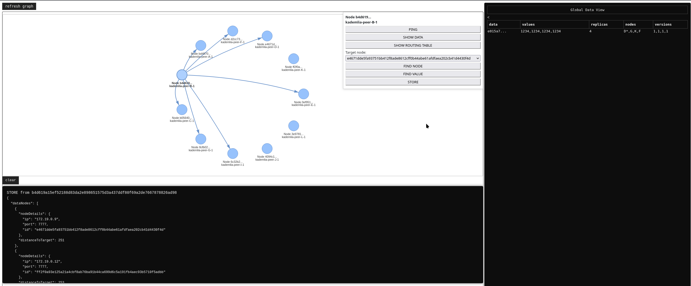

This project focused on implementing the Kademlia Distributed Hash Table (DHT) to solve a core challenge in distributed systems: efficiently locating and retrieving resources in a decentralized network. 
Kademlia was chosen for its simplicity and efficiency.

The implementation followed the original design from Kademlia: A Peer-to-Peer Information System Based on the XOR Metric by Petar Maymounkov and David Mazieres, with some updates for modern use. 
The keyspace was expanded to 256 bits using SHA-256, and RPCs were implemented in Go with gRPC. 
To test the system, Docker containers simulated a distributed network, allowing for a full evaluation of RPC behavior and the lookup process.

A web GUI was also developed using Python FastAPI that interacts with Docker to visualize the cluster in a ring topology.

The DHT includes a controlled replication algorithm for stored data, built around two roles:
- leaser - the node closest to the key of the stored data; responsible for performing replication
- replicas - the K nearest nodes (excluding the leaser) that the leaser replicates data to

### What happens when the leaser node dies?
If the replicas stop receiving refreshes from the leaser, they will eventually time out and each declare themselves the new leaser.

### How to avoid split-brain behavior?

Because replication targets the K closest nodes to a key, those K nodes will inevitably include all of the newly self-declared leasers. 
Each of them will replicate to the other K-1 leasers plus one additional node to fill the gap left by the dead leaser.

When a leaser receives a replica from a node that is closer to the key (determined by XOR bitlength distance between the node ID and the replica's key, with alphabetical node ID as a tiebreaker), it concedes and demotes itself to a replica. 
After the first round of replication among the self-declared leasers, only the one closest to the key will remain as leaser.

### What happens if the dead leaser rejoins?

When the dead leaser rejoins the network, it will be among the K closest nodes, so the standing leaser will replicate to it. 
Since the revived node is closer to the key than the current leaser, it will self-declare as the new leaser based on the leaser metadata attached to the replica.

The revived leaser then replicates to the K closest nodes, which acknowledge it as the new leaser based on that metadata. 
The node that gets pushed out of the K replicas will eventually time out, self-declare as leaser, and attempt to replicate but upon reaching the K nodes that are already aware of the better leaser, it will delete its own replica copy.
As a result, the replica count in the cluster is always maintained at K + 1 (K replicas plus the leaser).

The replication also contains versioning of data.

## UI

In the screenshot above you can observe the ring topology. On the right is a table displaying the data stored across the cluster.

Columns:
- data - the SHA-256 hash representing the key of the stored data
- value - the value stored on each node
- replicas - the total number of replicas in the cluster
- nodes - the nodes where the data is stored, an asterisk (*) denotes the leaser
- versions - the version of the data stored on each node

Below the topology is a panel showing the responses returned by the various RPCs.

## How to start

1. Use the commands in the subfolders to compile the .proto files
2. Run the docker compose file in the kademlia-peer folder
3. Start the UI locally with the command provided in the README.md under visualization folder